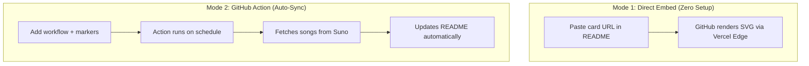
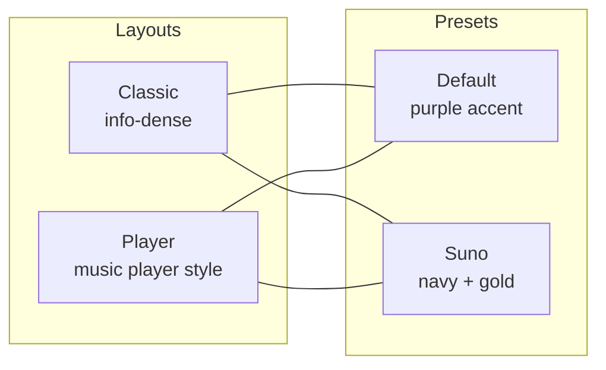
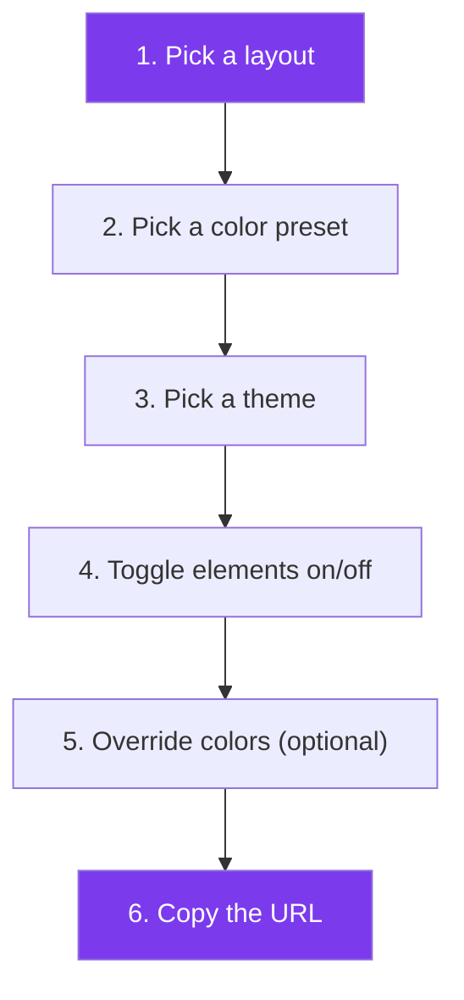
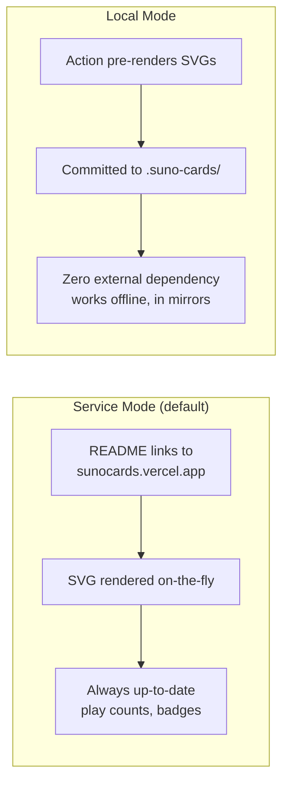
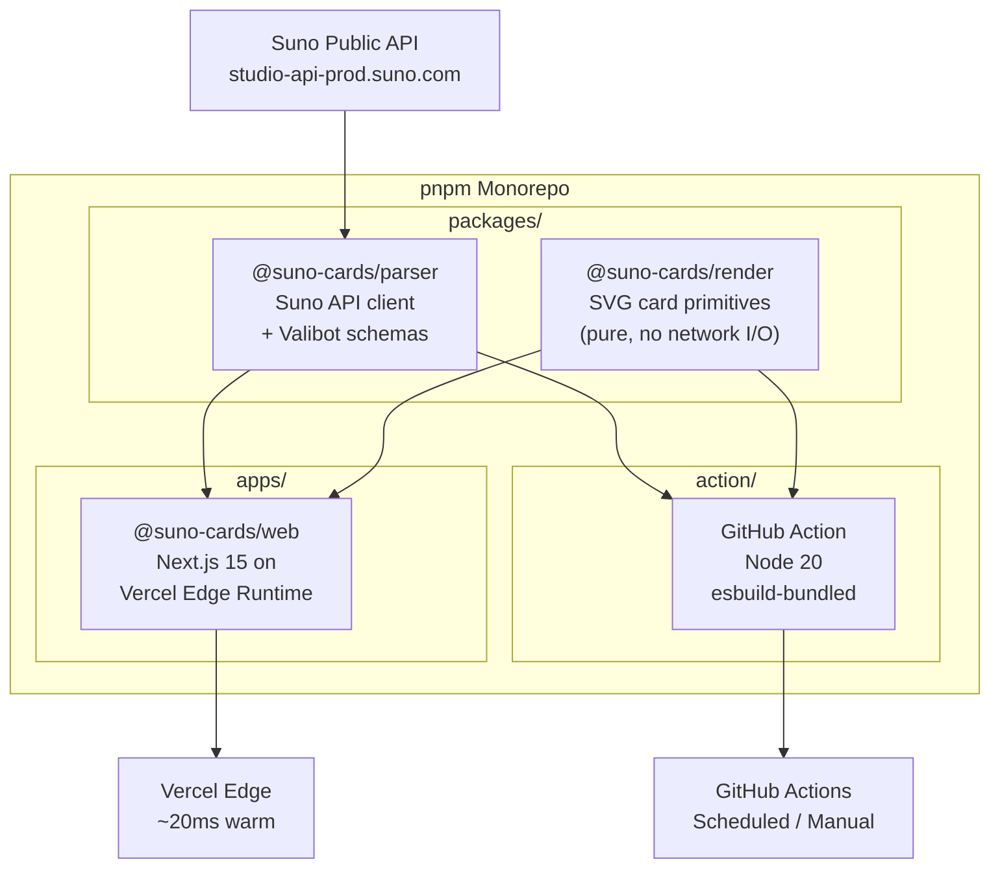

# github-readme-suno-cards

Display your [Suno AI](https://suno.com/)-generated music as dynamic, animated SVG cards in your GitHub profile README.

[](https://github.com/ChanMeng666/github-readme-suno-cards/actions/workflows/ci.yml)
[](./LICENSE)
[](https://sunocards.vercel.app)

> **Give us your Suno handle and do nothing else.** Your GitHub README stays in sync with your music — new songs, play counts, and likes appear automatically.

**[Live Demo & Builder](https://sunocards.vercel.app)** | **[Browse Gallery](https://sunocards.vercel.app/gallery)** | **[Build Your Card](https://sunocards.vercel.app/builder)**

---

## Table of Contents

- [How It Works](#how-it-works)
- [Quick Start (2 minutes)](#quick-start)
- [Embed a Single Card (no setup)](#embed-a-single-card)
- [Style Gallery](#style-gallery)
  - [Layouts + Presets](#layouts--presets)
  - [Theme Variants](#theme-variants)
  - [Toggle Showcases](#toggle-showcases)
  - [Custom Accent Colors](#custom-accent-colors)
  - [Profile & Card Stack](#profile--card-stack)
- [Customization Guide](#customization-guide)
- [API Reference](#api-reference)
- [GitHub Action Reference](#github-action-reference)
- [Render Modes](#render-modes)
- [Architecture](#architecture)
- [Web App](#web-app)
- [Roadmap](#roadmap)
- [Acknowledgements](#acknowledgements)
- [License](#license)

---

## How It Works


The project has two usage modes:



---

## Quick Start

### Step 1 — Add markers to your README

```markdown
## My Suno Music

<!-- SUNO-CARDS:START -->
<!-- SUNO-CARDS:END -->
```

### Step 2 — Create `.github/workflows/suno-cards.yml`

```yaml
name: Update Suno cards

on:
  schedule:
    - cron: '0 */6 * * *'   # Every 6 hours
  workflow_dispatch:

permissions:
  contents: write

jobs:
  update:
    runs-on: ubuntu-latest
    steps:
      - uses: actions/checkout@v4
      - uses: ChanMeng666/github-readme-suno-cards@v0.1
        with:
          handle: YOUR_SUNO_HANDLE
          sort: play_count
          max: 6
      - uses: EndBug/add-and-commit@v9
        with:
          message: 'chore(suno-cards): refresh'
          add: './README.md'
```

### Step 3 — Done!

Every 6 hours (or on manual trigger), the Action fetches your public songs, sorts them, and writes the cards between your markers.

---

## Embed a Single Card

No GitHub Action needed — paste a URL directly into your README:

```markdown
[](https://suno.com/song/YOUR_SONG_UUID)
```

The `id` parameter accepts:
- A full UUID: `a885e43c-6918-456f-a5f0-0e8e29e61066`
- A Suno URL: `https://suno.com/song/a885e43c-6918-456f-a5f0-0e8e29e61066`
- A short code: `https://suno.com/s/YourShortCode`

---

## Style Gallery

All examples below use a real demo song. **Replace `a885e43c-6918-456f-a5f0-0e8e29e61066` with your own song UUID** and copy the code to your README.

> **Tip**: Use the [interactive card builder](https://sunocards.vercel.app/builder) to customize any style visually, then copy the generated embed code.

### Layouts + Presets

There are **2 layouts** x **2 color presets** = 4 base combinations.



---

#### Classic + Default

Info-dense layout with purple accent — title, author, tags, stats, model badge, animated equalizer.

[](https://suno.com/song/a885e43c-6918-456f-a5f0-0e8e29e61066)

```markdown
[](https://suno.com/song/YOUR_SONG_UUID)
```

---

#### Classic + Suno

Info-dense layout with Suno's official navy + gold palette.

[](https://suno.com/song/a885e43c-6918-456f-a5f0-0e8e29e61066)

```markdown
[](https://suno.com/song/YOUR_SONG_UUID)
```

---

#### Player + Default

Suno-style music player with progress bar, play button, and SUNO logo — using the default purple theme.

[](https://suno.com/song/a885e43c-6918-456f-a5f0-0e8e29e61066)

```markdown
[](https://suno.com/song/YOUR_SONG_UUID)
```

---

#### Player + Suno

The full Suno official look — player layout with navy + gold palette.

[](https://suno.com/song/a885e43c-6918-456f-a5f0-0e8e29e61066)

```markdown
[](https://suno.com/song/YOUR_SONG_UUID)
```

---

### Theme Variants

Each card supports three theme modes:

| Theme | Behavior |
|---|---|
| `auto` (default) | Switches with GitHub's dark/light setting via `prefers-color-scheme` |
| `dark` | Always dark background |
| `light` | Always light background |

#### Classic — Light

[](https://suno.com/song/a885e43c-6918-456f-a5f0-0e8e29e61066)

```markdown
[](https://suno.com/song/YOUR_SONG_UUID)
```

#### Player + Suno — Light

[](https://suno.com/song/a885e43c-6918-456f-a5f0-0e8e29e61066)

```markdown
[](https://suno.com/song/YOUR_SONG_UUID)
```

#### Classic + Suno — Light

[](https://suno.com/song/a885e43c-6918-456f-a5f0-0e8e29e61066)

```markdown
[](https://suno.com/song/YOUR_SONG_UUID)
```

#### Player + Default — Light

[](https://suno.com/song/a885e43c-6918-456f-a5f0-0e8e29e61066)

```markdown
[](https://suno.com/song/YOUR_SONG_UUID)
```

---

### Toggle Showcases

Fine-tune which elements appear on your card. All toggles accept `true` or `false`.

#### Minimal Classic — Title and cover only

[](https://suno.com/song/a885e43c-6918-456f-a5f0-0e8e29e61066)

```markdown
[](https://suno.com/song/YOUR_SONG_UUID)
```

#### Full Info Classic — Every element visible

[](https://suno.com/song/a885e43c-6918-456f-a5f0-0e8e29e61066)

```markdown
[](https://suno.com/song/YOUR_SONG_UUID)
```

#### Full Info Player — Player with tags, author, and stats

[](https://suno.com/song/a885e43c-6918-456f-a5f0-0e8e29e61066)

```markdown
[](https://suno.com/song/YOUR_SONG_UUID)
```

#### Player — No Equalizer

[](https://suno.com/song/a885e43c-6918-456f-a5f0-0e8e29e61066)

```markdown
[](https://suno.com/song/YOUR_SONG_UUID)
```

#### Player — With Stats

[](https://suno.com/song/a885e43c-6918-456f-a5f0-0e8e29e61066)

```markdown
[](https://suno.com/song/YOUR_SONG_UUID)
```

---

### Custom Accent Colors

Override the accent color with any hex value using the `accent_color` parameter (without the `#`).

#### Red Accent (`ff6b6b`)

[](https://suno.com/song/a885e43c-6918-456f-a5f0-0e8e29e61066)

```markdown
[](https://suno.com/song/YOUR_SONG_UUID)
```

#### Teal Accent (`2dd4bf`)

[](https://suno.com/song/a885e43c-6918-456f-a5f0-0e8e29e61066)

```markdown
[](https://suno.com/song/YOUR_SONG_UUID)
```

#### Orange Accent (`fb923c`)

[](https://suno.com/song/a885e43c-6918-456f-a5f0-0e8e29e61066)

```markdown
[](https://suno.com/song/YOUR_SONG_UUID)
```

#### Pink Accent (`f472b6`)

[](https://suno.com/song/a885e43c-6918-456f-a5f0-0e8e29e61066)

```markdown
[](https://suno.com/song/YOUR_SONG_UUID)
```

#### Green Accent (`22c55e`)

[](https://suno.com/song/a885e43c-6918-456f-a5f0-0e8e29e61066)

```markdown
[](https://suno.com/song/YOUR_SONG_UUID)
```

#### Blue Accent (`38bdf8`)

[](https://suno.com/song/a885e43c-6918-456f-a5f0-0e8e29e61066)

```markdown
[](https://suno.com/song/YOUR_SONG_UUID)
```

---

### Profile & Card Stack

#### Profile Summary Card

Show your Suno profile stats at a glance — avatar, handle, total plays, likes, followers.

[](https://suno.com/@chanmeng)

```markdown
[](https://suno.com/@YOUR_HANDLE)
```

#### Auto-Discovered Card Stack

Your top songs, sorted and stacked together. Use the `max` parameter to control how many.

[](https://suno.com/@chanmeng)

```markdown
[](https://suno.com/@YOUR_HANDLE)
```

---

## Customization Guide

### How to customize step-by-step



Or use the **[interactive builder](https://sunocards.vercel.app/builder)** for a visual drag-and-drop experience.

### Layout options

| Layout | Description | Best for |
|---|---|---|
| `classic` | Info-dense Spotify-style card with tags, stats, badges | Detailed song info |
| `player` | Suno-style music player with progress bar and play button | Clean, visual look |

### Color presets

| Preset | Colors | Vibe |
|---|---|---|
| `default` | Purple accent on dark/light background | Modern, neutral |
| `suno` | Navy + gold palette matching Suno's brand | Official look |

### Theme modes

| Theme | Behavior |
|---|---|
| `auto` | Follows GitHub's dark/light toggle via CSS `prefers-color-scheme` |
| `dark` | Always dark background |
| `light` | Always light background |

### Element toggles

Each element can be shown or hidden independently. Defaults vary by layout.

| Toggle | Classic default | Player default | Controls |
|---|---|---|---|
| `show_equalizer` | `true` | `true` | Animated equalizer bars on cover |
| `show_tags` | `true` | `false` | Genre/mood tag chips |
| `show_plays` | `true` | `false` | Play count |
| `show_likes` | `true` | `false` | Like count |
| `show_author` | `true` | `false` | Author byline |
| `show_duration` | `true` | `false` | Duration pill on cover |
| `show_model_badge` | `true` | `false` | Suno model badge (v4.5/v5) |
| `show_new_badge` | `true` | `false` | NEW ribbon on recent songs |
| `show_progress` | `false` | `true` | Progress bar + play button |
| `show_logo` | `false` | `true` | SUNO logo in bottom-right |
| `show_link_icon` | `false` | `true` | Link icon in top-right |

### Color overrides

Fine-tune any color with hex values (with or without `#`):

| Parameter | Description |
|---|---|
| `bg_color` | Card background |
| `text_color` | Title / primary text |
| `subtext_color` | Secondary text |
| `accent_color` | Equalizer bars, chips, progress bar |
| `border_color` | Card border |

**Example — Full custom colors:**

```markdown
[](https://suno.com/song/YOUR_SONG_UUID)
```

---

## API Reference

### Endpoints

| Endpoint | Description |
|---|---|
| `GET /api/card?id=<uuid\|url\|short>` | Single song card (SVG) |
| `GET /api/profile?handle=<handle>` | Profile summary card (SVG) |
| `GET /api/cards?handle=<handle>` | Stacked multi-card auto-discovery (SVG) |
| `GET /song/<uuid>` | Pretty URL alias for `/api/card?id=<uuid>` |

Base URL: `https://sunocards.vercel.app`

### `/api/card` Parameters

| Parameter | Type | Default | Description |
|---|---|---|---|
| `id` | string | **required** | Song UUID, Suno URL, or short code |
| `layout` | `classic` \| `player` | `classic` | Card layout |
| `preset` | `default` \| `suno` | `default` | Color preset |
| `theme` | `auto` \| `dark` \| `light` | `auto` | Theme mode |
| `lang` | `en` \| `zh` \| `ja` | `en` | Language |
| `width` | `200`–`1200` | auto | Card width in pixels |
| `show_equalizer` | boolean | layout-dep. | Animated equalizer |
| `show_tags` | boolean | layout-dep. | Tag chips |
| `show_plays` | boolean | layout-dep. | Play count |
| `show_likes` | boolean | layout-dep. | Like count |
| `show_author` | boolean | layout-dep. | Author byline |
| `show_duration` | boolean | layout-dep. | Duration pill |
| `show_model_badge` | boolean | layout-dep. | Model badge |
| `show_new_badge` | boolean | layout-dep. | NEW ribbon |
| `show_progress` | boolean | layout-dep. | Progress bar |
| `show_logo` | boolean | layout-dep. | SUNO logo |
| `show_link_icon` | boolean | layout-dep. | Link icon |
| `max_tags` | `0`–`20` | auto | Max tag chips |
| `bg_color` | hex | preset | Background color |
| `text_color` | hex | preset | Primary text color |
| `subtext_color` | hex | preset | Secondary text color |
| `accent_color` | hex | preset | Accent color |
| `border_color` | hex | preset | Border color |

### `/api/profile` Parameters

| Parameter | Type | Default | Description |
|---|---|---|---|
| `handle` | string | **required** | Suno user handle |
| `theme` | `auto` \| `dark` \| `light` | `auto` | Theme mode |
| `lang` | `en` \| `zh` \| `ja` | `en` | Language |
| `width` | `200`–`1200` | auto | Card width |
| `bg_color`, `text_color`, `subtext_color`, `accent_color`, `border_color` | hex | preset | Color overrides |

### `/api/cards` Parameters

Includes all `/api/card` visual parameters, plus:

| Parameter | Type | Default | Description |
|---|---|---|---|
| `handle` | string | **required** | Suno handle |
| `sort` | `created_at` \| `play_count` \| `upvote_count` \| `name` | `created_at` | Sort order |
| `max` | `1`–`20` | `6` | Max cards |
| `include_tags` | CSV | — | Only songs matching these tags |
| `exclude_tags` | CSV | — | Exclude songs matching these tags |
| `min_duration` | seconds | — | Minimum duration |
| `max_duration` | seconds | — | Maximum duration |
| `min_plays` | integer | — | Minimum play count |
| `min_likes` | integer | — | Minimum like count |
| `pinned_first` | boolean | `true` | Prioritize pinned songs |
| `featured` | CSV of UUIDs | — | Pin specific songs above all |
| `allow_explicit` | boolean | `true` | Include explicit songs |
| `show_profile_card` | boolean | `true` | Show profile card above songs |

### Caching

- **Upstream** (Suno API calls): revalidated every 3600s (card) or 600s (profile/cards)
- **Downstream** (HTTP response): `Cache-Control: s-maxage=3600, stale-while-revalidate=86400`
- GitHub's Camo proxy caches SVGs — changes may take up to an hour to appear

---

## GitHub Action Reference

### Data Source (pick one)

| Input | Default | Description |
|---|---|---|
| `handle` | — | Your Suno handle (auto-discovery mode) |
| `manifest_path` | `./suno-songs.yml` | Path to YAML manifest of song IDs |
| `song_ids` | — | Comma-separated UUIDs inline |

### Filters & Ranking

| Input | Default | Description |
|---|---|---|
| `sort` | `created_at` | `created_at` \| `play_count` \| `upvote_count` \| `name` |
| `max` | `6` | Max song cards (1–20) |
| `include_tags` | — | CSV substring filter (case-insensitive) |
| `exclude_tags` | — | CSV substring filter |
| `min_duration` / `max_duration` | — | Seconds |
| `min_plays` / `min_likes` | — | Integer floors |
| `pinned_first` | `true` | Respect `is_pinned` above sort order |
| `featured` | — | CSV of UUIDs pinned above everything |
| `allow_explicit` | `true` | Include explicit-tagged songs |
| `show_profile_card` | `true` | Emit profile card above song cards |

### Visual Style

| Input | Default | Description |
|---|---|---|
| `layout` | `classic` | `classic` or `player` |
| `preset` | `default` | `default` (purple) or `suno` (navy + gold) |
| `theme` | `auto` | `auto` / `dark` / `light` |
| `lang` | `en` | `en` / `zh` / `ja` |
| `width` | — | Card width in px (200–1200) |
| `bg_color` | — | Background hex (with or without `#`) |
| `text_color` | — | Primary text color |
| `accent_color` | — | Accent color |
| `show_progress` | layout-dep. | Progress bar + play button |
| `show_logo` | layout-dep. | SUNO logo in bottom-right |
| `show_link_icon` | layout-dep. | Link icon in top-right |

### Output & Format

| Input | Default | Description |
|---|---|---|
| `render_mode` | `service` | `service` (live) or `local` (pre-render SVGs) |
| `local_cards_dir` | `.suno-cards` | Output dir in local mode |
| `readme_path` | `./README.md` | Path to README |
| `comment_tag_name` | `SUNO-CARDS` | Marker name (allows multiple instances) |
| `output_type` | `markdown` | `markdown` or `html` (with `<picture>` theme switching) |
| `output_only` | `false` | Skip README write, emit via outputs only |
| `base_url` | `https://sunocards.vercel.app` | Self-hosted service override |

### Action Outputs

| Output | Description |
|---|---|
| `profile` | JSON-encoded `SunoProfile` |
| `clips` | JSON-encoded array of `SunoSong` |
| `cards_block` | The markdown/HTML block written to README |
| `rendered_files` | JSON array of SVG paths (local mode only) |

---

## Render Modes



### Service (default)

The Action writes markdown pointing at the hosted Vercel service. Cards auto-update whenever anyone views your README — play counts, NEW badges, and any data change reflects live.

```yaml
# No extra config needed — service mode is the default
- uses: ChanMeng666/github-readme-suno-cards@v0.1
  with:
    handle: YOUR_HANDLE
```

### Local

The Action pre-renders SVGs with embedded base64 cover images into `.suno-cards/` in your repo. Zero dependency on any hosted service.

```yaml
- uses: ChanMeng666/github-readme-suno-cards@v0.1
  with:
    handle: YOUR_HANDLE
    render_mode: local
    local_cards_dir: '.suno-cards'
```

---

## Architecture



### Package breakdown

| Package | Role |
|---|---|
| `packages/parser` | Suno API client + Valibot schemas. Zero HTML scraping — uses only public `studio-api-prod.suno.com` endpoints. |
| `packages/render` | SVG card primitives. Pure functions, no network I/O. Template-literal SVG with `<foreignObject>` for CJK-friendly rich text. |
| `apps/web` | Next.js 15 on Vercel Edge Runtime. 3 API routes + 3-page React frontend with Tailwind CSS. |
| `action` | Node 20 GitHub Action. Bundled with esbuild, committed `dist/index.js`. |

### Rendering technique

- **SVG with `<foreignObject>`** for CJK-friendly rich text layout
- **CSS `@media (prefers-color-scheme)`** for auto dark/light theming
- **CSS `@keyframes` on HTML `<span>`s** inside foreignObject for the animated equalizer bars
- **Dual-layer caching**: Vercel Data Cache for upstream Suno calls + HTTP `Cache-Control` for downstream GitHub Camo proxy

### Data source compliance

Uses only the public `https://studio-api-prod.suno.com` endpoints that Suno publishes as their oEmbed provider. No cookies, no session tokens, no reverse-engineered auth.

---

## Web App

The project includes a full 3-page React frontend at **[sunocards.vercel.app](https://sunocards.vercel.app)**:

| Page | URL | Description |
|---|---|---|
| **Home** | [sunocards.vercel.app](https://sunocards.vercel.app) | Hero showcase, feature highlights, featured card styles |
| **Gallery** | [sunocards.vercel.app/gallery](https://sunocards.vercel.app/gallery) | Browse 20+ curated presets with layout/preset/theme filters |
| **Builder** | [sunocards.vercel.app/builder](https://sunocards.vercel.app/builder) | Interactive card builder with live preview, toggles, color pickers, and embed code generator |

Built with Next.js 15, React 18, Tailwind CSS, and `next-themes` for dark/light mode.

---

## Features

- **Two layouts** — `classic` (info-dense Spotify-style) and `player` (Suno-style music player with progress bar)
- **Two color presets** — `default` (purple) and `suno` (official navy + gold), freely combinable with any layout
- **Fine-grained element toggles** — show/hide equalizer, progress bar, tags, stats, logo, link icon, and more
- **Custom color overrides** — `bg_color`, `text_color`, `subtext_color`, `accent_color`, `border_color` on top of any preset
- **Spotify-style animated equalizer bars** — 4 CSS-animated bars overlay your cover art
- **Handle-based auto-discovery** — set your handle once, new songs appear automatically
- **Dark/light theme** — auto-switches with GitHub's UI theme via CSS `prefers-color-scheme`
- **Smart tag classification** — genres, instruments, moods, vocal types, and tempo rendered as distinct chips
- **Suno-native model badges** — `v4.5` / `v5` badges use exact theme tokens from Suno's own UI
- **"NEW" ribbon** on songs published in the last 7 days
- **Profile summary card** — avatar, handle, total plays, likes, followers
- **Multi-language** — English, Simplified Chinese, Japanese out of the box
- **Vercel Edge Runtime** — cold start 30-80ms, warm requests ~20ms from edge cache
- **Interactive card builder** — visual configurator at [sunocards.vercel.app/builder](https://sunocards.vercel.app/builder)
- **20+ gallery presets** — curated card styles browsable at [sunocards.vercel.app/gallery](https://sunocards.vercel.app/gallery)
- **Compliance-first** — uses only the public Suno oEmbed endpoints; no cookies, no reverse-engineered auth

---

## Examples

See [`examples/`](./examples) for ready-to-copy workflow files:

| File | Mode | Description |
|---|---|---|
| [`auto-discovery.yml`](./examples/auto-discovery.yml) | Service | Zero-config auto-discovery — just your handle |
| [`manifest-mode.yml`](./examples/manifest-mode.yml) | Service | Explicit song list via YAML manifest |
| [`local-mode.yml`](./examples/local-mode.yml) | Local | Pre-render SVGs to your repo |
| [`suno-songs.yml`](./examples/suno-songs.yml) | — | Sample manifest file |

---

## Roadmap

### v0.2

- [ ] **Waveform card variant** (Action local mode only) — download MP3, compute amplitude samples, render SVG `<path>`
- [ ] **Lyrics excerpt card** — parse `[Chorus]` from structured prompt, render as card subtitle
- [ ] **Playlist card** — render Suno playlists
- [ ] **JSON API** — `/api/song.json` and `/api/profile.json` for third-party tools
- [ ] **PNG export** — `/api/card.png` via `@resvg/resvg`

### v0.3

- [ ] **Vercel KV play-count history** — trending arrows (`+15 this week`), weekly summaries
- [ ] **RSS/Atom feed per handle** — `/api/feed/{handle}.xml`

### v0.4+

- [ ] Cover-art color extraction for per-song gradient backgrounds
- [ ] Song-DNA radar chart card
- [ ] Year-in-review card

---

## Acknowledgements

The card primitives borrow ideas from several excellent projects:

- [`github-readme-medium-recent-article`](https://github.com/omidnikrah/github-readme-medium-recent-article) — Next.js + Vercel architecture
- [`github-readme-youtube-cards`](https://github.com/DenverCoder1/github-readme-youtube-cards) — dual-mode Action + service, theme switching
- [`blog-post-workflow`](https://github.com/gautamkrishnar/blog-post-workflow) — esbuild bundling, marker-replace regex, CI dist-diff verification
- [`spotify-github-profile`](https://github.com/kittinan/spotify-github-profile) — CSS-animated equalizer overlay technique

---

## License

[MIT](./LICENSE)

---

Made with music by [Suno](https://suno.com/)
